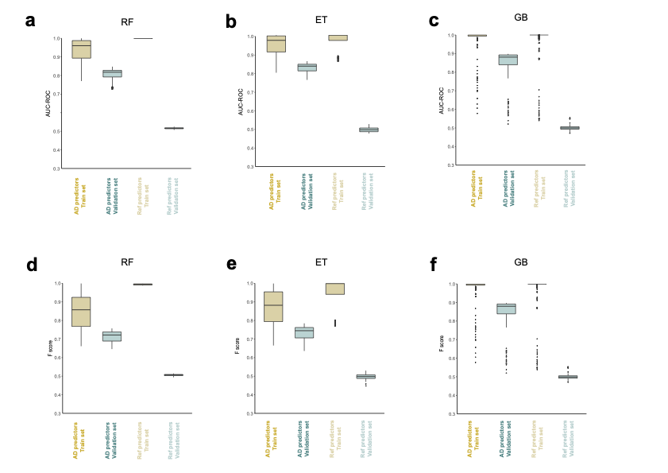

# Machine learning methods applied to genotyping data in late onset Alzheimer’s disease

Python scripts used in the article: *Machine learning methods applied to genotyping data capture interactions between single nucleotide variants in late onset Alzheimer’s disease*

Scripts are divided by the different ML methods used in the article:

- GB : GradientBoostingClassifier
- RF : RandomForestClassifier
- ET : ExtraTreesClassifier

#### Methods: ML models, building and evaluation

Python 3.7.6 with Scikit-learn v0.22.1 module was used to build the machine learning models. A train/test split was applied to have 80% of samples for training and 20% of samples for testing.  Initially samples were balanced to have the same proportion of LOAD and controls using two strategies: random undersampling and oversampling with SMOTE. Hyper-parameter selection and overfitting correction was performed on the training set through a 10-fold cross-validation. Two metrics such as AUC-ROC and f-score were considered for determining the best hyper-parameter configuration for each model and to avoid overfitting. For each combination of hyper-parameters, we obtained the mean and the standard deviation across the 10 folds on the training and validation set. We decided to use random undersampling because oversampling strategy was prone to overfitting. In order to select the best hyper-parameter configuration, we selected the parameters with: a) higher mean in the two evaluation metrics, b) lower standard deviation of the evaluation metrics across the 10 cross-validation folds, c) lower mean differences in the evaluation metrics when comparing train and validation sets in order to correct for overfitting. The selected hyper-parameter values are listed in *Supplementary Table 1, page 3*.

In addition, we used 199 random SNVs not present in the 145 AD related SNVs as reference predictors. These reference SNVs were located in genes from DisGeNet *"curated gene-disease associations”* dataset but not reported in the *“curated variant-disease associations”* dataset using the AD categories in *Supplementary Table 1, page 2*. Models were evaluated with the AD predictors and reference predictors independently. The median of AUC-ROC (*Figure below a, b, c*) and f-score (*Figure below d, e, f*)  was around 0.5 in validation sets of models with reference predictors, and higher than 0.7 in validation sets of models with AD predictors. With these differences, we confirmed that the good performance of the models on the validation set using the selected AD SNVs as predictors (from 0.7 to 0.9) is not due to an overfitting effect caused by the intrinsic properties of genomic variants in the selected genomic regions, as applying the 10-fold cross-validation with reference SNVs the performances were around 0.5.

The final model with the optimized parameters was trained on the original train set (80%) and tested on the test set (20% of samples).

#### Python scripts to run 10 fold cross-validation with the 80% of samples in the training split:

- \*\_DisGeNet_CV_Over.py : Oversampling to balance samples and AD SNVs as predictors
- \*\_DisGeNet_CV_Under.py : Undersampling to balance samples and AD SNVs as predictors
- \*\_refVars_CV_Over.py : Oversampling to balance samples and reference SNVs as predictors
- \*\_refVars_CV_Under.py : Undersampling to balance samples and reference SNVs as predictors

#### Python scripts to test the model with the 20% of samples in the testing split:

- \*\_finalModel.py : Final model with the definitive parameters selected in the cross-validation step

